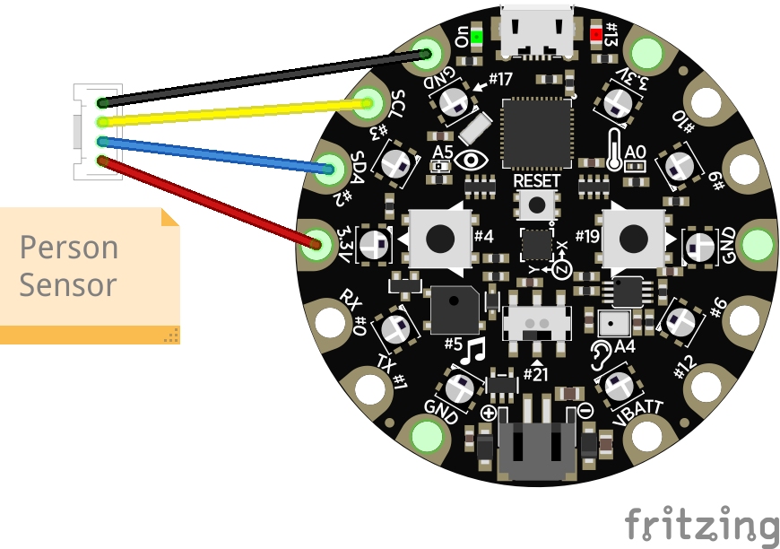

# TV Remote Control with a Person Sensor

Pause and play your TV when you get up from the couch, using a Person Sensor and a Circuit Playground Express.

## Introduction

The [Person Sensor](https://usfl.ink/ps) from [Useful Sensors](https://usefulsensors.com)
is a small, low-cost hardware module that detects nearby peoples’ faces, and
returns information about how many there are, where they are relative to the
device, and performs facial recognition. It is designed to be used as an input
to a larger system, and this example shows how to use it to control a TV so that
it pauses what you're watching when you leave the viewing area, and resumes when
you return.

## BoM

To build this project you'll need:

 - [Circuit Playground Express](https://www.adafruit.com/product/3333).
 - [Person Sensor from Useful Sensors](https://usfl.ink/ps).
 - [Qwiic connector cable with alligator clips](https://www.adafruit.com/product/4398).
 - Blu Tack or something similar to hold the sensor in place.

No soldering is required. You need to make sure you get the "Express" version of
the Circuit Playground board, because this is the only one with a built-in IR
transmitter and receiver. You can probably adapt this to other boards with
external IR modules, but you'll need to figure out how to interface them with
CircuitPython. At the time of writing, the Circuit Playground Express board was
out of stock at Adafruit, but the slightly more expensive [base kit](https://www.adafruit.com/product/3517)
that includes one was in stock.

## Assembling

Wiring up the sensor requires a cable with a Qwiic/Stemma QT connector on one
end, and four alligator clips on the other. These clips connect VDD, GND, SDA
and SCL from the sensor to the board. First plug in the connector to the sensor.
This should only connect one way round, with the exposed metal facing the board.
The alligator clips then connect to four tabs on the Circuit Playground. If the
side with the buttons and components on is facing you, you start at the 11 
o'clock position with GND (black), the anti clockwise with SDC (yellow), then
SDA (blue), and finally 3.3V (red). Here's a wiring diagram:

Once the Circuit Playground is plugged into USB, you should see the green light
on the person sensor glow when a face is visible.

### Mounting

The Person Sensor needs to be mounted on the back of the board, on the opposite
side to the buttons. This will be looking back at you on the couch, while the IR
transmitter on the other side sends commands to the TV to play or pause
depending on whether you're around. I bought [an enclosure](https://www.adafruit.com/product/3915)
and used Blu Tack to mount the sensor in the right position, but I'm sure those
of you more skilled can come up with a more elegant solution.

## Setting up Circuit Python

You should read the [official guide to setting up CircuitPython on a Circuit Playground Express](hhttps://learn.adafruit.com/adafruit-circuit-playground-express/circuitpython-quickstart)
for the latest information, but here is a summary:

 - Download CircuitPython for your board from circuitpython.org. The CPX
 version is available at [circuitpython.org/board/circuitplayground_express/](https://circuitpython.org/board/circuitplayground_express/).
 This project has been tested using the `7.3.3` version. I normally recommend
 the 8.x version, but I found the IR decoder library had some extra logging
 spam with the beta.
 - Hold down the `reset` button in the center of the board and plug it into a USB port.
 - Drag the CircuitPython uf2 file onto the `CPLAYBOOT` drive that appears.

Once you've followed those steps, you should see a new `CIRCUITPY` drive appear.
You can now drag `code.py` files onto that drive and the Pico should run them.

## Install Libraries

We need the [adafruit_irremote library](https://docs.circuitpython.org/projects/irremote/en/latest/)
to control the IR sensors, so the first step is to download a big bundle of all
the CircuitPython libraries from [circuitpython.org/libraries](https://circuitpython.org/libraries).
You'll need to find the right bundle for your CircuitPython version.

Once you have that downloaded, unpack the bundle on your local machine. In the
file viewer, go to the `lib` folder within the unpacked bundle and copy the
`adafruit_irremote.mpy` file into the `lib` folder on the `CIRCUITPYTHON` drive.
This should install the library we need to drive the infrared codes.

## Install the Code

Now your carousel is set up, copy the `code.py` file from this repository into
the `CIRCUITPYTHON` drive. You should notice that the green LED on the Person
Sensor lights up when it sees your face.